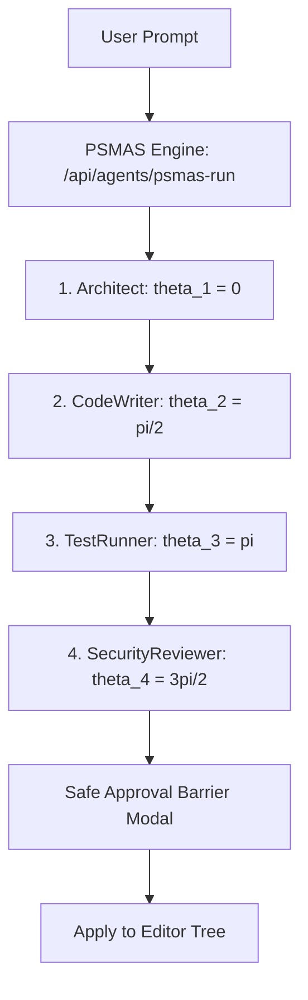

# OmniGraph Studio — Developer & Agent Guidelines (`CLAUDE.md`)

This guide governs development, agent reasoning protocols, and architectural standards for **OmniGraph Studio** (Open Gigantic Assignment III).

---

## 🛠️ 1. Project Commands & Toolchain
- **Package Manager:** `npm`
- **Framework:** Next.js 16 (App Router + Turbopack), React 19, TypeScript
- **Dev Server:** `npm run dev` (starts on `http://localhost:3000`)
- **Production Build:** `npm run build` (Turbopack static + dynamic route generation)
- **Lint & Typecheck:** `npm run lint`

---

## 🎨 2. Design System & Aesthetics
- **Theme:** Obsidian Dark (`#0d1117`, `#161b22`, `#010409`) with sub-pixel 1px hairlines (`#30363d`).
- **Typography:** System Sans (`-apple-system`, `Geist`) for UI, monospace (`SF Mono`, `ui-monospace`) for code and AST coordinates.
- **Accents:**
  - Surgical Emerald (`#3fb950`): Accepted diffs, token savings, active path nodes.
  - Cyan (`#58a6ff`): PSMAS sweep needle, primary links, architect phase.
  - Ruby (`#f85149`): Deletions, baseline costs, security warnings.
  - Amber (`#d29922`): Grepping phase, human review warnings, test runners.
  - Purple (`#bc8cff`): Thinking stage, abstract reasoning.

---

## 🤖 3. Multi-Agent AI Pipeline
When implementing or extending agent workflows, strictly follow the PSMAS circular manifold protocol:

### Agent Rules:
1. **Never inject full files blindly:** Always use progressive AST disclosure (`Module` $\rightarrow$ `File` $\rightarrow$ `Function` $\rightarrow$ `Assertion`).
2. **Surgical Hunks Only:** All code modifications must be formatted as discrete diff hunks targeting exact line ranges.
3. **Strict Human Gate:** No mutations may be committed without explicit user confirmation via the `SafeApprovalModal`.

---

## 📂 4. Core Directory Layout
- `src/components/graph/`: `ObjectGraphHUD.tsx`, `GraphCanvas.tsx`, and custom node types (`ModuleNode`, `FileNode`, `FunctionNode`, `AssertionNode`).
- `src/components/psmas/`: `PSMASRadar.tsx`, `TerminalLogs.tsx`, `AgentTimeline.tsx`.
- `src/components/editor/`: `CodeEditor.tsx`, `DiffViewer.tsx`, `SafeApprovalModal.tsx`.
- `src/components/telemetry/`: `TokenTelemetry.tsx`, `SWEBenchCard.tsx`.
- `src/components/multiplayer/`: `MultiplayerBar.tsx`.
- `src/components/layout/`: `Screen15Overview.tsx`, `Navbar.tsx`, `StatusBar.tsx`.
- `src/lib/store/`: `useOmniStore.ts` (Unified reactive Zustand store).
- `src/lib/agents/`: `psmasEngine.ts` (Phase scheduling & agent coordination).
- `src/lib/graph/`: `ogParser.ts` (AST progressive disclosure & token reduction).
- `src/lib/diff/`: `surgicalDiff.ts` (Hunk-based patch generator).

---

## 🚀 5. Deployment & Verification
- **GitHub Repository:** [https://github.com/bhaktofmahakal/omnigraph-studio](https://github.com/bhaktofmahakal/omnigraph-studio)
- **Live Vercel Deployment:** [https://omnigraph-studio.vercel.app](https://omnigraph-studio.vercel.app)
- **Zero-Error Mandate:** Every commit must pass `npm run build` with 0 TypeScript errors and 0 lint warnings.
